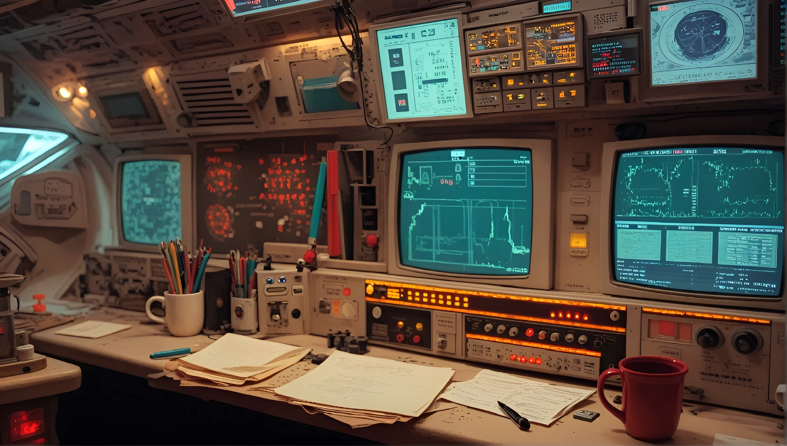

# FastOverlay 0.1.0 [ALPHA-2026-07-08]: High-Performance Native Transparent Overlay API for Java

[](https://github.com/andrestubbe/FastOverlay/releases/tag/0.1.0)
[](https://opensource.org/licenses/MIT)
[](https://www.java.com)
[]()
[](https://jitpack.io/#andrestubbe/FastOverlay)

---

**⚡ Hardware-accelerated DirectComposition transparent overlays, sub-millisecond visual translation, and runtime click-through toggle for Java.**

**FastOverlay** provides ultra-fast native overlay windows directly composited by the Windows Desktop Window Manager (DWM). Designed for AI agent bounding-box visualization, robotics HUDs, game telemetry, and UI debugging with zero flickering, zero AWT EDT lag, and true OS-level click-through pass-through (`WS_EX_TRANSPARENT`).



---

## Quick Start

```java
import fastoverlay.FastOverlay;
import fastoverlay.FastOverlayWindow;
import java.awt.Color;
import java.awt.Font;

public class Demo {
    public static void main(String[] args) throws InterruptedException {
        // 1. Initialize native DirectComposition engine
        FastOverlay.initEngine();

        // 2. Create a transparent, topmost click-through overlay (420x160)
        FastOverlayWindow overlay = new FastOverlayWindow(100, 100, 420, 160, true, true);

        // 3. Render vector graphics directly onto the native DWM surface
        overlay.setPainter(g -> {
            g.setColor(new Color(16, 185, 129, 210)); // Emerald Green
            g.fillRoundRect(0, 0, 420, 160, 24, 24);

            g.setColor(Color.WHITE);
            g.setFont(new Font("Segoe UI", Font.BOLD, 20));
            g.drawString("⚡ FastOverlay Active", 24, 45);

            g.setFont(new Font("Segoe UI", Font.PLAIN, 15));
            g.drawString("Click-Through: Enabled (Ghost Mode)", 24, 85);
            g.drawString("Hardware GPU Compositing @ 60 FPS", 24, 115);
        });

        overlay.show();

        // 4. Smooth GPU visual translation without Win32 SetWindowPos overhead
        overlay.setVisualOffset(250, 180);
    }
}
```

---

## Table of Contents

- [Quick Start](#quick-start)
- [Why FastOverlay?](#why-fastoverlay)
- [Key Features](#key-features)
- [Real-World Use Cases](#real-world-use-cases)
- [API Quick Reference](#api-quick-reference)
- [Technical Demos & Benchmarks](#technical-demos--benchmarks)
- [Installation](#installation)
- [Documentation](#documentation)
- [Platform Support](#platform-support)
- [Related Projects](#related-projects)
- [License](#license)

---

## Why FastOverlay?

Standard Java GUI toolkits (Swing `JWindow`, JavaFX transparent stages) are notoriously unsuited for real-time desktop overlays:

- **Heavyweight GDI Repaint Delays**: Standard Java translucent windows force expensive software rasterization, resulting in 15–40 ms redraw latency and visible flickering during animations.
- **Flawed Click-Through**: Pure Java lacks native `WS_EX_TRANSPARENT` integration. Clicks cannot fall through to underlying windows without custom native hacks or third-party wrappers.
- **Focus & Foreground Disruption**: Moving or repainting an AWT window often steals active focus from fullscreen applications, games, or IDEs.

**FastOverlay** solves this by leveraging modern DirectComposition and native Win32 layered surfaces:

| Feature | Standard Java (AWT / Swing) | FastOverlay |
|:---|:---|:---|
| **Compositing Pipeline** | GDI / Software Blit | DirectComposition GPU Layer |
| **Input Pass-Through** | ❌ Mouse clicks blocked / absorbed | ✅ True OS-level `WS_EX_TRANSPARENT` |
| **Dynamic Click-Through Toggle** | ❌ Window recreation required | ✅ Instant runtime toggle (`setClickThrough`) |
| **Animation Translation** | Slow Win32 `SetWindowPos` (~5–15 ms) | Sub-millisecond GPU visual node offset |
| **Flicker & Tearing** | ⚠️ Frequent redraw artifacts | ✅ 100% Tear-free DWM composited |
| **Focus Disruption** | ⚠️ Steals focus or flashes | ✅ Non-activating `WS_EX_NOACTIVATE` |

---

## Key Features

- ⚡ **DirectComposition GPU Compositing**: Hardware-accelerated layered surfaces rendering directly into the Windows DWM pipeline.
- 👻 **True Click-Through & Ghost Mode**: Mouse events fall through seamlessly to background games and applications without latency.
- 🎯 **Runtime Property Toggling**: Switch between click-through and solid interactive click states on the fly without recreating the window.
- 🚀 **Hardware Visual Translation**: Translate HUDs and bounding boxes across the screen via `setVisualOffset()` without invoking heavyweight Win32 window repositioning.
- 🖼️ **Swing Integration (`FastOverlayPanel`)**: Easily embed native GPU-accelerated DirectComposition surfaces inside existing Java Swing applications.
- 📦 **Zero-Allocation Hot Paths**: Pre-allocated native pixel exchange buffers prevent GC pauses during continuous 60/120 FPS animation loops.

---

## Real-World Use Cases

- 🤖 **Autonomous AI & Vision Agent HUDs**: Draw live bounding boxes, confidence labels, and planned action vectors over targeted applications.
- 👻 **Ghost Cursor & Mouse Telemetry**: Render secondary automated cursors (`FastGhostMouse`) and heatmaps with zero interference to the human user.
- 🎮 **Game & Esports Overlays**: Real-time FPS counters, crosshairs, minimap telemetry, and stats overlays floating above fullscreen borders.
- 🧪 **Live UI Regression & Automation Debugging**: Highlight tested DOM/UIA elements in real time during automated end-to-end testing runs.

---

## API Quick Reference

| Method | Return Type | Description | Docs |
|:---|:---|:---|:---|
| `FastOverlay.initEngine()` | `void` | Initializes native DirectComposition and DWM rendering subsystems. | [Reference](docs/REFERENCE.md#fastoverlay-static-lifecycle--engine) |
| `FastOverlay.disposeEngine()` | `void` | Releases global native resources and terminates the engine. | [Reference](docs/REFERENCE.md#fastoverlay-static-lifecycle--engine) |
| `FastOverlayWindow(...)` | `FastOverlayWindow` | Creates a hardware-accelerated transparent overlay window handle. | [Reference](docs/REFERENCE.md#fastoverlaywindow-high-level-window-handle) |
| `setClickThrough(enabled)` | `void` | Dynamically toggles click-through input transparency at runtime. | [Reference](docs/REFERENCE.md#fastoverlaywindow-high-level-window-handle) |
| `setTopmost(topmost)` | `void` | Dynamically updates topmost z-order layering. | [Reference](docs/REFERENCE.md#fastoverlaywindow-high-level-window-handle) |
| `setPainter(painter)` | `void` | Renders vector drawing routine directly to native surface. | [Reference](docs/REFERENCE.md#fastoverlaywindow-high-level-window-handle) |
| `updateImage(img)` | `void` | Submits pre-rendered `BufferedImage` to the GPU surface. | [Reference](docs/REFERENCE.md#fastoverlaywindow-high-level-window-handle) |
| `setVisualOffset(x, y)` | `void` | Translates the visual node with sub-millisecond GPU speed. | [Reference](docs/REFERENCE.md#fastoverlaywindow-high-level-window-handle) |
| `setPosition(x, y)` | `void` | Adjusts physical Win32 window coordinate boundaries. | [Reference](docs/REFERENCE.md#fastoverlaywindow-high-level-window-handle) |
| `setSize(w, h)` | `void` | Resizes the overlay drawing canvas surface. | [Reference](docs/REFERENCE.md#fastoverlaywindow-high-level-window-handle) |
| `show()` / `hide()` | `void` | Toggles overlay visibility without destroying native handles. | [Reference](docs/REFERENCE.md#fastoverlaywindow-high-level-window-handle) |
| `dispose()` | `void` | Closes native window and frees associated device contexts. | [Reference](docs/REFERENCE.md#fastoverlaywindow-high-level-window-handle) |

---

## Technical Demos & Benchmarks

| Case | Java Example | Launcher | Description |
|:---|:---|:---|:---|
| **Animated DirectComposition HUD** | [Demo.java](examples/Demo/src/main/java/fastoverlay/Demo.java) | `run-demo.bat` | 60 FPS floating HUD showcasing GPU translation and 4-second dynamic click-through toggle. |
| **DirectComposition JMH Benchmarks** | [Benchmark.java](examples/Benchmark/src/main/java/fastoverlay/Benchmark.java) | `run-benchmark.bat` | JMH throughput benchmark measuring repaint speed, sub-millisecond translation, and click-through toggles. |

---

## Installation

### Option 1: Maven (Recommended)

Add the JitPack repository and dependencies to your `pom.xml`:

```xml
<repositories>
    <repository>
        <id>jitpack.io</id>
        <url>https://jitpack.io</url>
    </repository>
</repositories>

<dependencies>
    <!-- FastOverlay Library -->
    <dependency>
        <groupId>com.github.andrestubbe</groupId>
        <artifactId>FastOverlay</artifactId>
        <version>0.1.0</version>
    </dependency>

    <!-- FastCore Native Loader -->
    <dependency>
        <groupId>com.github.andrestubbe</groupId>
        <artifactId>FastCore</artifactId>
        <version>0.1.0</version>
    </dependency>
</dependencies>
```

### Option 2: Gradle (via JitPack)

```groovy
repositories {
    maven { url 'https://jitpack.io' }
}

dependencies {
    implementation 'com.github.andrestubbe:FastOverlay:0.1.0'
    implementation 'com.github.andrestubbe:FastCore:0.1.0'
}
```

### Option 3: Direct Download (No Build Tool)

Download the release JARs directly from [GitHub Releases](https://github.com/andrestubbe/FastOverlay/releases/tag/0.1.0):

1. 📦 **[FastOverlay-0.1.0.jar](https://github.com/andrestubbe/FastOverlay/releases/tag/0.1.0)** (Core Overlay Library)
2. ⚙️ **[FastCore-0.1.0.jar](https://github.com/andrestubbe/FastCore/releases/tag/0.1.0)** (Mandatory Native Loader)

> [!IMPORTANT]
> Both JARs must be included in your classpath for the JNI calls to function correctly.

---

## Documentation

- **[COMPILE.md](docs/COMPILE.md)**: Full compilation guide (MSVC C++17 build chain + JNI Setup).
- **[REFERENCE.md](docs/REFERENCE.md)**: Comprehensive API specification, DirectComposition architecture, and lifecycle methods.
- **[PHILOSOPHY.md](docs/PHILOSOPHY.md)**: The engineering rationale for hardware-native overlay compositing.
- **[ROADMAP.md](docs/ROADMAP.md)**: Planned milestone features and platform expansion.
- **[CHANGELOG.md](docs/CHANGELOG.md)**: Complete version history and release notes.

---

## Platform Support

| Platform | Architecture | Status | Driver / Subsystem |
|:---|:---:|:---:|:---|
| **Windows 10 / 11** | x64 | ✅ Fully Supported | DirectComposition, Direct2D & Win32 Layered DWM |
| **Linux** | x64 / AArch64 | 🚧 Planned | Wayland Subsurfaces & X11 Composite Extension |
| **macOS** | Apple Silicon / x64 | 🚧 Planned | `NSWindow` Non-Activating Translucent Panels |

---

## Related Projects

- **[`FastCore`](https://github.com/andrestubbe/FastCore)**: Native Library Loader & JNI Utilities for Java
- **[`FastGhostMouse`](https://github.com/andrestubbe/FastGhostMouse)**: High-Performance Native Ghost Cursor Overlay
- **[`FastRobot`](https://github.com/andrestubbe/FastRobot)**: Low-Latency Native Input & Bot Automation Substrate
- **[`FastScreen`](https://github.com/andrestubbe/FastScreen)**: High-Speed DXGI Screen Capture Engine (240–2000 FPS)
- **[`FastTheme`](https://github.com/andrestubbe/FastTheme)**: Native Windows System Theme & Titlebar Dark Mode API
- **[`FastWindow`](https://github.com/andrestubbe/FastWindow)**: Native Win32 Window Management & Styling Substrate

---

## License

MIT License. See [LICENSE](LICENSE) file for details.

---

**Part of the FastJava Ecosystem**. *Making the JVM faster.* 🚀


